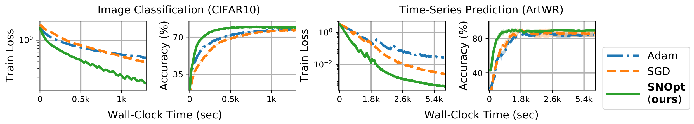

<h1 align='center'>
    Second-order Neural ODE Optimizer<br />(NeurIPS 2021 Spotlight) [<a href="https://arxiv.org/abs/2109.14158">arXiv</a>]
    <h4 align='center'>
        :heavy_check_mark: faster convergence in wall-clock time | :heavy_check_mark: O(1) memory cost | <br /> :heavy_check_mark: better test-time performance | :heavy_check_mark: architecture co-optimization
    </h4>
</h1>


This repo provides PyTorch code of
<ins>**S**</ins>econd-order <ins>**N**</ins>eural ODE <ins>**Opt**</ins>imizer (**SNOpt**),
a second-order optimizer for training Neural ODEs that retains O(1) memory cost with superior convergence and test-time performance.

<p align="center">

</p>


## Installation

This code is developed with Python3. PyTorch >=1.7 (we recommend 1.8.1) and [torchdiffeq](https://github.com/rtqichen/torchdiffeq) >= 0.2.0 are required.

1. Install the dependencies with [Anaconda](https://www.anaconda.com/products/individual) and activate the environment `snopt` with
    ```bash
    conda env create --file requirements.yaml python=3
    conda activate snopt
    ```
2. [Optional] This repo provides a modification (with [15 lines](https://github.com/ghliu/snopt/commit/2a31f247c9e4de8bfba097b6704a28f19a9af1b1)!) of [`torchdiffeq`](https://github.com/rtqichen/torchdiffeq/tree/5a819e471c15cac5e4ec97a0e472b1569a1a872b) that allows **SNOpt** to collect 2nd-order information during adjoint-based training. If you wish to run `torchdiffeq` on other commit, simply copy-and-paste the folder to this directory then apply the provided [`snopt_integration.patch`](https://github.com/ghliu/snopt/blob/main/snopt_integration.patch).
    ```bash
    cp -r <path_to_your_torchdiffeq_folder> .
    git apply snopt_integration.patch
    ```

## Run the code
We provide example code for 8 datasets across **image classification** (`main_img_clf.py`), **time-series prediction** (`main_time_series.py`), and **continuous normalizing flow** (`main_cnf.py`). The command lines to generate similar results shown in our paper are detailed in [`scripts`](https://github.com/ghliu/snopt/blob/main/scripts) folder. Datasets will be automatically downloaded to `data` folder at the first call, and all results will be saved to `result` folder.
```bash
bash scripts/run_img_clf.sh     <dataset> # dataset can be {mnist, svhn, cifar10}
bash scripts/run_time_series.sh <dataset> # dataset can be {char-traj, art-wr, spo-ad}
bash scripts/run_cnf.sh         <dataset> # dataset can be {miniboone, gas}
```

For architecture (specifically integration time) co-optimization, run
```bash
bash scripts/run_img_clf.sh cifar10-t1-optimize
```

## Integration with your workflow

**`snopt`** can be integrated flawlessly with existing training work flow. Below we provide a handy checklist and pseudo-code to help your integration. For more complex examples, please refer to `main_*.py` in this repo.

- [ ] Import `torchdiffeq` that is patched with [snopt integration](https://github.com/ghliu/snopt/blob/main/snopt_integration.patch); otherwise simply use `torchdiffeq` in this repo.
- [ ] Inherit `snopt.ODEFuncBase` as your vector field; implement the forward pass in `F` rather than `forward`.
- [ ] Create Neural ODE with ode layer(s) using `snopt.ODEBlock`; implement properties `odes` and `ode_mods`.
- [ ] Initialize `snopt.SNOpt` as preconditioner; call `train_itr_setup()` and `step()` before standard `optim.zero_grad()` and `optim.step()` (see the code below).
- [x] That's it :nerd_face:! Enjoy your second-order training :steam_locomotive: → :bullettrain_front:!


```python3
import torch
from torchdiffeq import odeint_adjoint as odesolve
from snopt import SNOpt, ODEFuncBase, ODEBlock
from easydict import EasyDict as dict

class ODEFunc(ODEFuncBase):
    def __init__(self, opt):
        super(ODEFunc, self).__init__(opt)
        self.linear = torch.nn.Linear(input_dim, input_dim)

    def F(self, t, z):
        return self.linear(z)

class NeuralODE(torch.nn.Module):
    def __init__(self, ode):
        super(NeuralODE, self).__init__()
        self.ode = ode

    def forward(self, z):
        return self.ode(z)

    @property
    def odes(self): # in case we have multiple odes, collect them in a list
        return [self.ode]

    @property
    def ode_mods(self): # modules of all ode(s)
        return [mod for mod in self.ode.odefunc.modules()]

# Create Neural ODE
opt = dict(
    optimizer='SNOpt',tol=1e-3,ode_solver='dopri5',use_adaptive_t1=False,snopt_step_size=0.01)
odefunc = ODEFunc(opt)
integration_time = torch.tensor([0.0, 1.0]).float()
ode = ODEBlock(opt, odefunc, odesolve, integration_time)
net = NeuralODE(ode)

# Create SNOpt optimizer
precond = SNOpt(net, eps=0.05, update_freq=100)
optim = torch.optim.SGD(net.parameters(), lr=0.001)

# Training loop
for (x,y) in training_loader:
    precond.train_itr_setup() # <--- additional step for precond
    optim.zero_grad()

    loss = loss_function(net(x), y)
    loss.backward()

    # Run SNOpt optimizer
    precond.step()            # <--- additional step for precond
    optim.step()

```


## What the library actually contains

This **`snopt`** library implements the following objects for efficient 2nd-order adjoint-based training of Neural ODEs.

- **`ODEFuncBase`**: Defines the vector field (inherits `torch.nn.Module`) of Neural ODE.
- **`CNFFuncBase`**: Serves the same purposes as `ODEFuncBase` except for CNF applications.
- **`ODEBlock`**: A Neural-ODE module (`torch.nn.Module`) that solves the initial value problem (given the vector field, integration time, and a ODE solver) and handles integration time co-optimization with [feedback policy](https://arxiv.org/pdf/2109.14158.pdf#page=7).
- **`SNOpt`**: Our primary 2nd-order optimizer (`torch.optim.Optimizer`), implemented as a "preconditioner" (see [example code](https://github.com/ghliu/snopt#integration-with-your-workflow) above). It takes the following arguments.
    - `net` is the Neural ODE. Note that the entire network (rather than `net.parameters()`) is required.
    - `eps` is the the regularization that stabilizes preconditioning. We recommend the value in [0.05, 0.1].
    - `update_freq` is the frequency to refresh the 2nd-order information. We recommend the value 100~200.
    - `alpha` decides the running averages of eigenvalues. We recommend fixing the value to 0.75.
    - `full_precond` decides whether we wish to precondition layers aside from those in Neural ODEs.
- **`SNOptAdjointCollector`**: A helper to collect information from `torchdiffeq` to construct 2nd-order matrices.
- **`IntegrationTimeOptimizer`**: Our 2nd-order method that co-optimizes the integration time (_i.e._, `t1`). This is done by calling `t1_train_itr_setup(train_it)` and `update_t1()` together with `optim.zero_grad()` and `optim.step()` (see [`trainer.py`](https://github.com/ghliu/snopt/blob/main/trainer.py)).


The options are passed in as `opt` and contains the following fields (see [`options.py`](https://github.com/ghliu/snopt/blob/main/options.py) for full descriptions.)
- `optimizer` is the training method. Use "SNOpt" to enable our method.
- `ode_solver` specifies the ODE solver (default is "dopri5") with the absolute/relative tolerance `tol`.
- For CNF applications, use `divergence_type` to specify how divergence should be computed.
- `snopt_step_size` determines the step sizes SNOpt will sample along the integration to compute 2nd-order matrices. We recommend the value 0.01 for integration time [0,1], which yield around 100 sampled points.
- For integration time (t1) co-optimization, enable the flag `use_adaptive_t1` and setup the following options.
    - `adaptive_t1` specifies t1 optimization method. Choices are "baseline" and "feedback"(ours).
    - `t1_lr` is the learning rate. We recommend the value in [0.05, 0.1].
    - `t1_reg` is the coefficient of the quadratic penalty imposed on t1. The performance is quite _sensitive_ to this value. We recommend the value in [1e-4, 1e-3].
    - `t1_update_freq` is the frequency to update t1. We recommend the value 50~100.

## Remarks & Citation

The current library only supports adjoint-based training, yet it can be extended to normal `odeint` method (stay tuned!). The pre-processing of tabular and uea datasets are adopted from [ffjord](https://github.com/rtqichen/ffjord) and [NeuralCDE](https://github.com/patrick-kidger/NeuralCDE), and the eigenvalue-regularized preconditioning is adopted from [EKFAC-pytorch](https://github.com/Thrandis/EKFAC-pytorch).

If you find this library useful, please cite :arrow_down:. Contact me (ghliu@gatech.edu) if you have any questions!
```
@inproceedings{liu2021second,
  title={Second-order Neural ODE Optimizer},
  author={Liu, Guan-Horng and Chen, Tianrong and Theodorou, Evangelos A},
  booktitle={Advances in Neural Information Processing Systems},
  year={2021},
}
```
